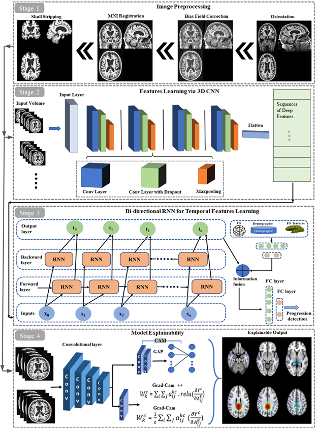
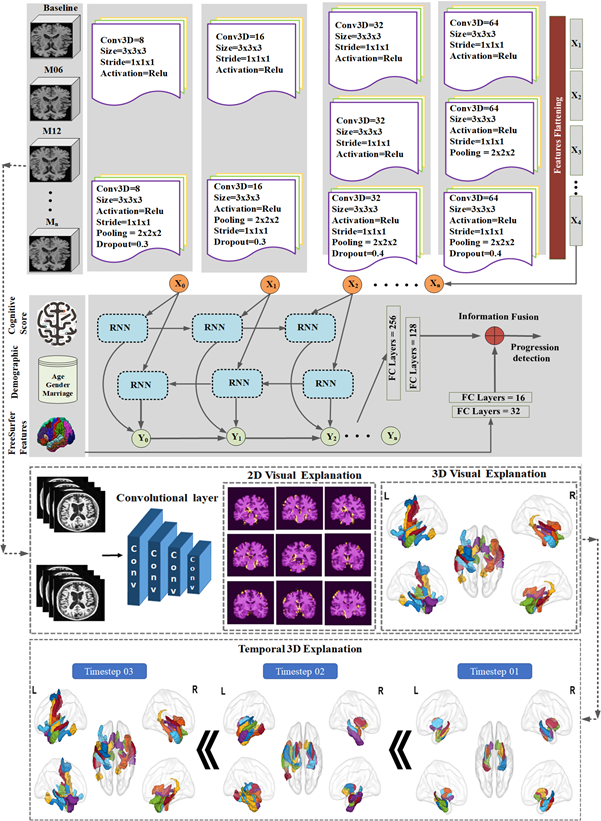
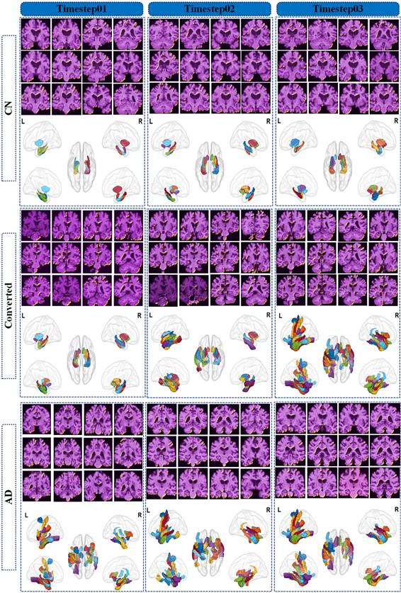

## Alzheimer disease progression detection from longitudional MRI
This is the Pytorch implementation of the paper "Alzheimer’s disease progression detection based on multimodal deep learning model and visual explainability of time series data". 

## Prerequisites:
* [Python3](https://www.python.org/)
* [Pytorch](https://pytorch.org/)
* [NiBabel](https://nipy.org/nibabel/)

## Proposed Framework:
https://github.com/InfoLab-SKKU/AD-progression-detection-MRI/blob/main/images/proposed_framework.png

## Work flow:
https://github.com/InfoLab-SKKU/AD-progression-detection-MRI/blob/main/images/workflow.png?raw=true

## Activated brain regions in longitudional MRI data
https://raw.githubusercontent.com/InfoLab-SKKU/AD-progression-detection-MRI/main/images/ExplainabilityFigure.PNG

## Data:
Please save the MRI ".npy" data into CN and AD folders, respectively. You can use the "data preprocessing/Baseline_volumes.py" for the baseline or "data preprocessing/BaselineMRI+M06MRI_volumes(two_timesteps).py" or BaselineMRI+M06MRI+M12MRI_volumes(three_timesteps).py" to prepare the data for multiple timesteps accordingly.

## Training-Testing:
After data preparation, any model (Proposed network, 3DVGG, 3DResNet) with any data combination can be trained and test with the provided code. Such as code for traininig-testing  proposed network with the baseline MRI data can be found in directory "ProposedNet/ProposedNet_at_BaselineMRI.py".  
